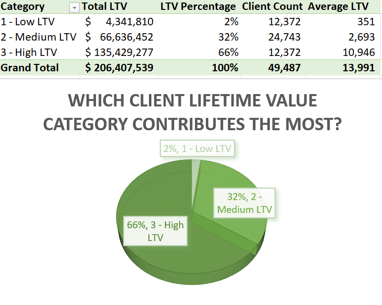
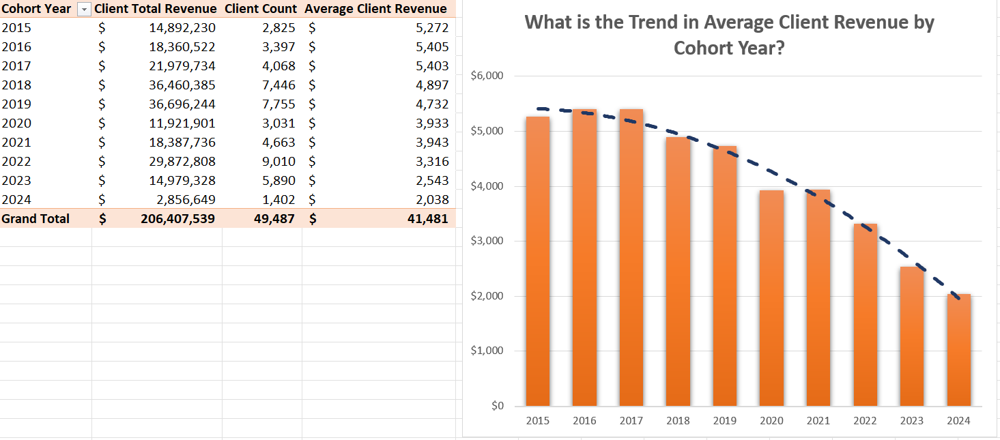
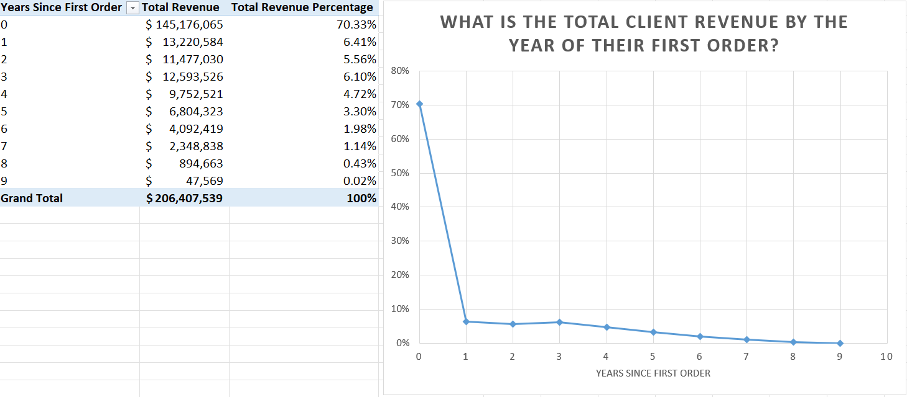
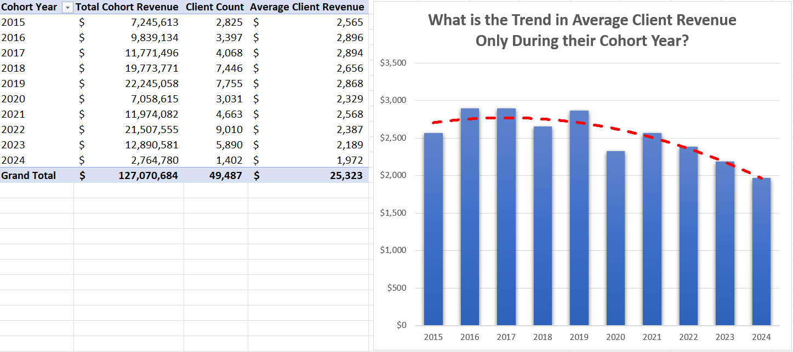
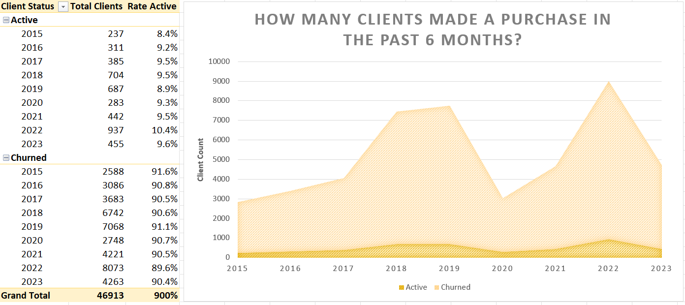

# Introduction

**This project** focuses on **analyzing customer behavior, retention**, and **lifetime value** for an e-commerce company. Using **PostgreSQL**, I extracted key insights from customer transaction data. The results were then visualized through **Excel charts** to clearly illustrate  trends and patterns. The **goal** of this **analysis** is to support strategic decisions aimed at improving **customer retention** and **maximizing revenue**.

# Background
To better understand **customer dynamics** and identify opportunities for growth, this project **analyzes** key aspects of **client behavior** and **value generation**. Using transactional data, the focus is on uncovering patterns in **client lifetime value (LTV)**, **cohort-based revenue trends**, and **long-term engagement**.

The main **questions** explored include:

**1. Which client LTV category contributes the most?**  
This helps identify which group of customers brings the highest overall value to the business.

**2. What is client revenue by cohort year?**  
This question examines how revenue develops for clients grouped by the year of their first purchase.  
*Due to its complexity and strategic importance, this analysis is explored in more detail.*

**3. How many clients are active since their first purchase year?**  
This tracks long-term engagement and customer loyalty over time.

*Data Source was provided by Luke Barousse. Check it out from here:* [Database](https://github.com/lukebarousse/Int_SQL_Data_Analytics_Course/releases/tag/v.0.0.0)

# Tools I Used

To analyze **client behavior**, **revenue**, and **lifetime value (LTV)** patterns, I used a combination of powerful tools and techniques across the data pipeline:
- **Data Extraction, Cleaning & Analysis**

    - **PostgreSQL** – The core database engine for querying and aggregating data.

    - **pgAdmin** & **DBeaver** – My main environments for writing, testing, and debugging SQL code.

    - Used advanced **SQL** techniques including:

        - **Window functions**

        - **Subqueries** and **CTE**s

        - **Conditional logic**

        - **Data cleaning & transformation**

- Data **Visualization** & Modeling

    - **Microsoft Excel** – For flexible and interactive data visualization.

        - **Power Query** – For importing and shaping data from PostgreSQL exports.

        - **Power Pivot** – For creating data models and relationships.

        - **Pivot Tables & Pivot Charts** – To analyze revenue trends, client cohorts, and LTV categories.

- **Version Control** & Collaboration

    - **Git & GitHub** – To manage project files, track code changes, and share my work publicly.

This toolset enabled efficient querying, deep behavioral analysis, and clear visual communication of key insights about **client revenue, retention**, and **contribution** by **LTV** categories.

# The Analysis

Each **question** was answered through structured **SQL queries** and data exploration techniques. Here's how I tackled each:

## 0. Clean Up Data

In this step, I aggregated **sales** and **client data** into key **revenue** metrics, calculated each **client's first order date** to enable **cohort analysis**, and created a unified **SQL view** that combines transactional records with **customer details**. Then I turned this **query** into a *cohort_table* **VIEW**.

*You can check it out here:* [0_create_cohort_table.sql](0_create_cohort_table.sql).  
|customerkey|orderdate|client_revenue|items_purchased|countryfull|age|full_name|first_order|cohort_year|
|-----------|---------|--------------|---------------|-----------|---|---------|-----------|-----------|
|1421414|2018-09-15|5334.056|2|United States|81|Deborah Hicks|2018-09-15|2018|
|950295|2022-10-06|3144.947915505|5|United Kingdom|62|Ethan Faulkner|2022-10-06|2022|
|11564|2023-11-01|6358.252625400001|6|Australia|25|Dylan Bate|2018-07-07|2018|
|1580373|2020-05-18|273.65999999999997|2|United States|45|Joan Sabol|2020-05-18|2020|
|1520374|2019-01-31|1497.792|1|United States|74|Ryan Moreno|2019-01-31|2019|

*5 Random Rows*

**This table** will serve as a foundational **dataset** for the subsequent **analysis** and **queries** throughout the **project**.

## 1. Which client LTV category contributes the most?

In this **query**, I categorized **clients** based on their total **lifetime value (LTV)**, grouping them into High, Mid, and Low-value **Сategories**. I also calculated key performance metrics such as **total revenue** for each **segment** to better understand **client value distribution**.

*You can check it out here:* [1_client_categories.sql](1_client_categories.sql).

### Table and Pie Chart  
   
*Table and Pie Chart Visualizations were created in Excel. You can check them out here:* [visualization.xlsx](visualization/visualization.xlsx)

### Insights:   
- The **top 33%** of **clients (High LTV)** generate the **majority of revenue**, despite being only a portion of the customer base.

- Upselling or converting **Medium** and **Low LTV clients** into **higher-value segments** could drive major **revenue gains**.

- This **segmentation** is ideal for targeted marketing and retention strategies.

## 2. What is client revenue by cohort year?  
*Queries available here:* [2_cohort_analysis.sql](2_cohort_analysis.sql)   
### Query 1: Client Cohorts by Total Lifetime Revenue

This **query** aggregates the **total revenue** generated by each **client cohort**, based on the year of their first order. All future purchases, regardless of when they occurred, are attributed to the client’s original cohort year.

For example, if a customer made their first order in 2017 and another in 2023, both transactions are counted toward the **2017 cohort’s total revenue**.   
### Table and Column Chart    
  
*Table and Column Chart Visualizations were created in Excel. You can check them out here:* [visualization.xlsx](visualization/visualization.xlsx)     
#### **Insight:**   
Earlier cohorts (2015–2017) show higher average LTV because they had more time to accumulate purchases. However, this skews the comparison with newer cohorts (e.g., 2023–2024), whose clients have not had enough time to reach their full potential.  
### Query 2: Revenue Timing After First Order

This query addresses the timing of revenue generation after a client's first order. It shows that:

- **70%** of the **total revenue** is made **within the same year** of a customer's **first purchase** (i.e., years since first order = 0)

- **Subsequent years** contribute **significantly less**, with revenue sharply declining from year 1 onward   
### Table and Linear Graph
   
*Table and Linear Visualizations were created in Excel. You can check them out here:* [visualization.xlsx](visualization/visualization.xlsx)     
#### **Insight:**  
This supports the assumption that **most customers do not return after their initial year**, making it crucial to assess **cohort** performance based only on **first-year activity**.   
 ### Query 3: Adjusted Cohort Revenue Based on First-Year Orders

To correct the bias in Query 1, this query recalculates **cohort revenue** by including only the orders placed during the **client’s first year**. So, if a client joined in 2017 and made orders in 2017 and 2023, only the 2017 orders are counted in that cohort’s revenue.   

### Table and Column Chart   
    
*Table and Column Chart Visualizations were created in Excel. You can check them out here:* [visualization.xlsx](visualization/visualization.xlsx)     

#### **Insights:**   
- This method provides a cleaner and fairer comparison between **cohorts**, especially for **newer years**, where **clients** haven't had the time to accumulate **long-term LTV**. It aligns with the behavioral trend observed in Query 2, where most clients generate revenue in **year 0**.     
- Besides **cleaning up cohort year data**, we still observe a **downward trend** in average **client revenue** over the years. This decline should be carefully evaluated by business experts and addressed strategically before the **end of 2024**.

## 3. How many clients are active since their first purchase year?

I conducted a **churn analysis** by identifying clients at risk of becoming **inactive**. This involved examining their most recent purchase behavior and calculating individual-level engagement metrics. Clients were labeled as **active** if they made a purchase within the last **six months**. A summary table was generated to show the number of **active** and **churned clients**, along with their **percentage distribution**, categorized by **cohort year**.

*You can check it out here:* [3_active_clients.sql](3_active_clients.sql)

### Table and Compound Line Graph    
   
*Table and Compound Line Graph Visualizations were created in Excel. You can check them out here:* [visualization.xlsx](visualization/visualization.xlsx)   

### Insights:  

- **High churn rate overall:** Across all cohorts, approximately **90–92%** of clients have **churned** (i.e., made no purchase in the last 6 months).

- **Slight improvement** for recent **cohorts**:

   - **2022 cohort** has the highest active rate at **10.40%**.

   - **2023 cohort** follows with **9.64%**, slightly better than earlier years.

- **Lowest retention**:

   - **2015 and 2019 cohorts** show the **lowest active** rates at **8.39% and 8.86%**, respectively.

- **Stability** in **churn trends**: The **active rate** stays around **9%** for most years, showing a consistently high **churn problem**

## Strategic Recommendations:

**1. Client Value Optimization** (Segmentation Strategy)

  - **Introduce a VIP program** tailored for the **12,372 high-value clients** who contribute around **66%** of **total revenue**.

  - Build personalized **upgrade journeys** for the **mid-value** segment to potentially double their contribution (from $66.6M to $135.4M).

  - Develop **budget-friendly promotions** aimed at **low-value clients** to encourage **more frequent purchases**.

**2. Improving Cohort Performance** (Revenue by Cohort Year)

  - **Focus** on **recent cohorts** (2022–2024) with targeted **re-engagement strategies**.

  - Launch **loyalty or subscription models** to help smooth out **revenue** volatility across **cohorts**.

  - Analyze and replicate successful tactics from **high-spending 2016–2018 client cohorts** to improve performance of newer groups.

**3. Retention & Churn Mitigation**

  - Enhance **client experience** in the **first 1–2 years** through strong onboarding and early-stage incentives.

  - Run **win-back campaign**s for **high-value clients** who have **churned**.

  - Deploy proactive **churn prevention** systems to detect and **retain clients** at risk of disengaging.

# What I Learned

**This project** strengthened my practical expertise in **SQL-based data analysis**, with a clear focus on understanding **client behavior, revenue trends, and lifetime value (LTV)**. I worked across the full data pipeline — from extraction and **cleaning** to **segmentation** and **cohort evaluation**.

  **Advanced SQL Techniques:**

  - Applied **Window functions** with `OVER (PARTITION BY ... ORDER BY ...)` to calculate rankings, rolling metrics, and **cohort-based LTV** dynamics.

  - Used **CTE**s (`WITH ... AS` clauses) to structure complex logic into modular and readable **query** blocks.

  - Built custom **Views** `CREATE VIEW ... AS` to encapsulate **cleaned** and **transformed datasets** — allowing for simplified, repeatable, and **query-ready** access to the curated **data model**. Performed in-depth **data cleaning**, including **filtering** invalid records (`COALESCE(...)`), **standardizing labels** (`EXTRACT(...)`, `TRIM(...)`), and **calculating** client-specific metrics for further **analysis** (`COUNT(...)`, `SUM(...)`...). Focused on reusability by ensuring the final **dataset views are clean, consistent, and ready for integration in future queries** and reporting tools (`SELECT * FROM my_view`).

  - **Designed queries** to classify **clients** as **active or churned** , calculate **retention** rates, and track **behavior** over time (`GROUP BY ...`).

**Excel for Visual Exploration:**

  - Utilized **Power Query** for importing **SQL** exports and shaping **data** as needed.

  - Created relationship models in **Power Pivot** and used **Pivot Tables & Charts** to visually validate patterns and **client segmentation** logic.

  - While **Excel** supported data presentation, the core of the project centered around **SQL**, and **visualization** was kept intentionally out of scope.

    *Visualization techniques used in my main Excel project can be viewed here:* [My_Excel_Data_Analysis_Project](https://github.com/DamtanX/My_Excel_Data_Analysis_Project)

# Special Thanks

I would like to extend my sincere thanks to **Luke Barousse** for offering a comprehensive Data Analyst course and sharing a rich dataset with his subscribers, including myself. His content was instrumental in building my understanding of **SQL**'s role in **Data Analysis** and served as the foundation for **this project**. I also want to acknowledge **ChatGPT**, which provided valuable support and guidance throughout the development of this project.

*Project Source:* [Database](https://github.com/lukebarousse/Int_SQL_Data_Analytics_Course/releases/tag/v.0.0.0)     
*Luke Barousse Reference:* [Luke Barousse YT](https://www.youtube.com/@LukeBarousse)

# Conclusion

**This project** demonstrates how structured **SQL analytics** combined with thoughtful **data modeling** can uncover actionable insights about **client behavior, revenue performance, and retention dynamics** in an e-commerce setting.

By leveraging **PostgreSQL** and **advanced query techniques** such as **Window functions, CTEs, and custom views**, I was able to build a **reliable, query-ready data model** that supports detailed **cohort and LTV analysis**. The results highlighted clear opportunities for **revenue optimization, client segmentation, and churn prevention**—all of which are critical to long-term business success.

Although **Excel** was used to explore and present the findings **visually** (with **Power Query, Power Pivot**, and various **charts**), the heart of this **project** lies in its **SQL**-driven approach. The focus was placed on designing a scalable and **reusable query framework** that could serve not just this **analysis**, but also future business intelligence efforts.

Through **this project**, I’ve deepened my ability to **clean, model, and analyze large-scale transactional data**—with a strong emphasis on **clarity, performance, and business value**.
